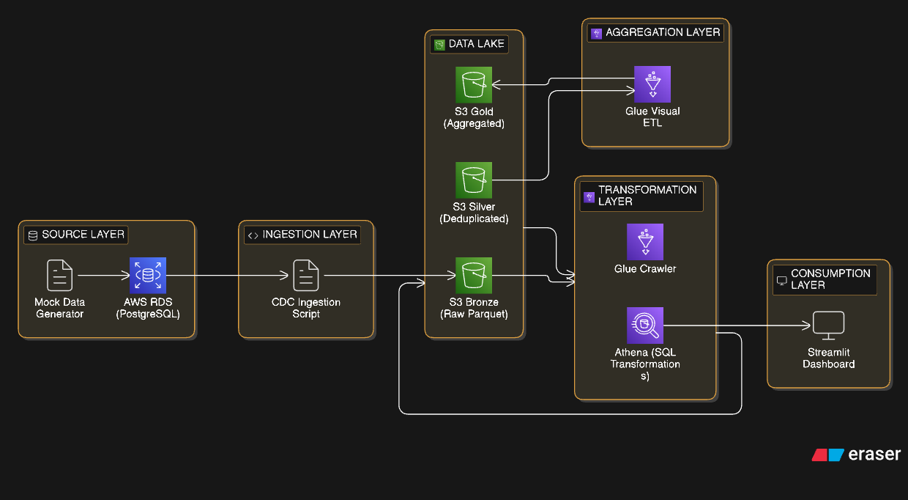
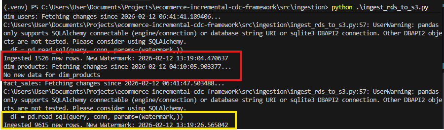
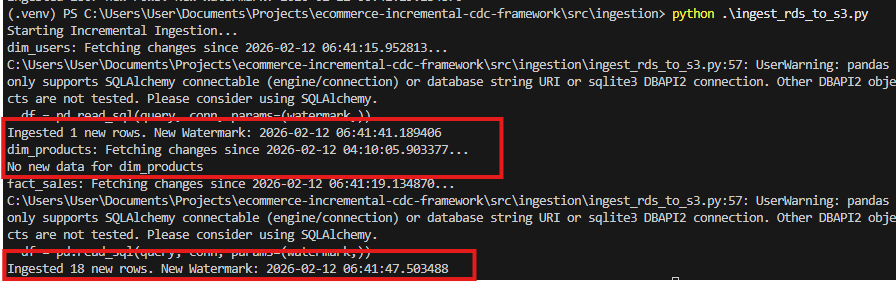
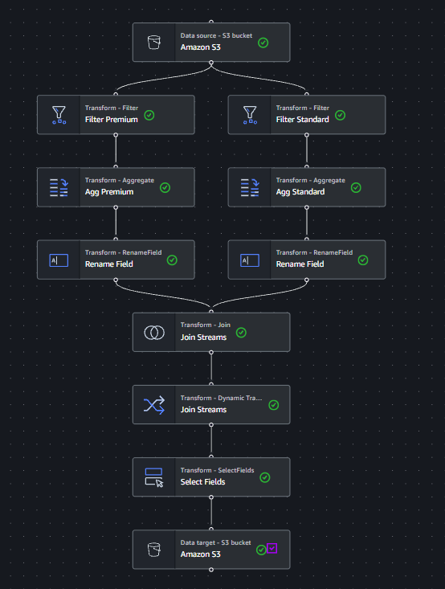
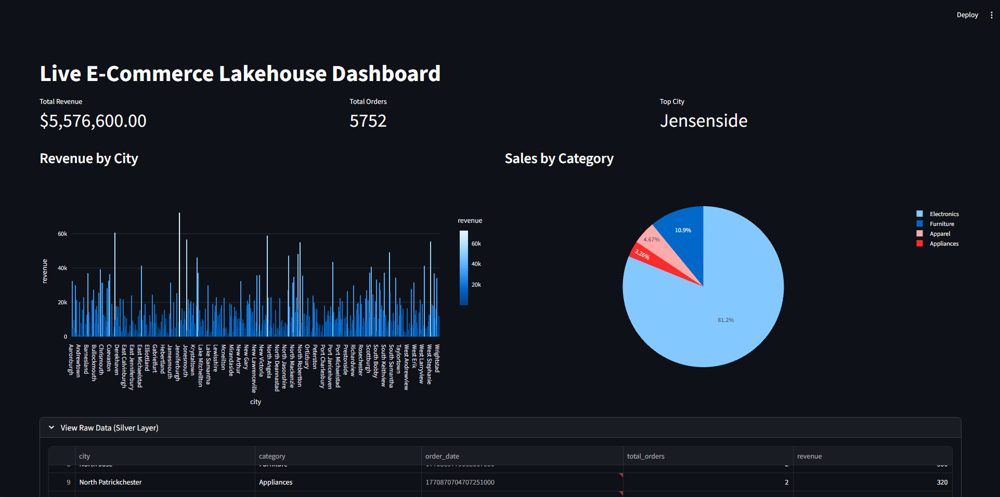

# End-to-End Event-Driven Data Lakehouse


## Project Overview

This project represents a complete, production-grade simulation of a modern **E-Commerce Data Platform**. It demonstrates an **Event-Driven Lakehouse Architecture** capable of ingesting transactional data, processing it incrementally, and serving real-time business insights to end-users.

In the current data engineering landscape, businesses often struggle with the latency between a transaction occurring and actionable insights being available. Traditional batch processing systems run once a night, meaning dashboards are always a day behind. This project solves that problem by implementing a Change Data Capture (CDC) pattern that moves data from the operational database to the analytical lakehouse in near real-time.

The system mimics a high-throughput production environment where a "Main App" generates simulated order data in a transactional database (RDS Postgres). A custom ingestion pipeline detects these changes (CDC), helps move them to a Data Lake (S3), and triggers transformation jobs (Athena/Glue) to create a "Gold" layer for analytics.

### Key Business Goals

This architecture was designed with specific business outcomes in mind:

*   **Decouple Analytics from Operations**: By moving heavy analytical queries off the production Online Transaction Processing (OLTP) database, we prevent performance degradation for the end-users of the e-commerce application. The operational database focuses on writing transactions, while the Data Lakehouse handles the reading and aggregation.
*   **Incremental Data Freshness**: The system ingests only *new* or *changed* data using Watermark-based CDC. This minimizes compute costs and latency compared to full-load extract, transform, load (ETL) pipelines that re-process the entire history daily.
*   **Historical Accuracy and Compliance**: The architecture handles Slowly Changing Dimensions (SCD) to ensure that changes in user profiles (e.g., address changes) or order statuses are tracked correctly over time.
*   **Cost Optimization**: By leveraging Serverless Compute (Athena, Glue) and cheap Object Storage (S3), the running costs of this platform are kept extremely low when idle, scaling only when data helps perform processing.

---

## System Architecture

The pipeline follows the industry-standard **Medallion Architecture** pattern, moving data from Bronze (Raw) to Silver (Cleaned) to Gold (Aggregated).



### Architectural Flow

1.  **Source System**: A Python-based mock data generator writes simulated e-commerce transactions to an AWS RDS PostgreSQL database. This acts as our source of truth.
2.  **Ingestion Layer**: A Python script runs on a schedule (or trigger), querying the RDS instance for any records with an `updated_at` timestamp greater than the last successful run.
3.  **Bronze Layer**: These incremental changes are written as Parquet files to the `bronze` bucket in Amazon S3. This is our raw, immutable history.
4.  **Transformation Layer**: AWS Glue Crawlers discover the schema of the new files. AWS Athena and Glue Jobs then process this data to deduplicate records and aggregate metrics.
5.  **Gold Layer**: The final, business-ready data is stored in the `gold` bucket, optimized for read performance.
6.  **Consumption Layer**: A Streamlit dashboard connects to the Gold layer (via Athena) to visualize Sales Performance, Order Status trends, and product metrics.

---

## Technology Stack & Design Decisions

The following technologies were chosen to simulate a realistic, scalable, and cost-effective enterprise environment.

| Component | Technology | Why I Chose It |
| :--- | :--- | :--- |
| **Infrastructure** | Terraform | **Infrastructure as Code (IaC)** allows for reproducible environments and version control of cloud resources. It ensures that the entire stack can be destroyed and recreated with a single command. |
| **Database** | AWS RDS (Postgres) | PostgreSQL is the industry standard for relational transactional (OLTP) workloads due to its reliability and rich feature set. |
| **Ingestion** | Python + Boto3 | Writing a custom ingestion script provides fine-grained control over **Incremental Loading** logic, error handling, and memory management compared to black-box tools like DMS. |
| **Storage** | Amazon S3 | S3 is the backbone of a Lakehouse. It is cheap, durable, and supports any file format (Parquet/JSON), decoupling storage from compute. |
| **Compute** | AWS Athena | Serverless SQL. It is a **cost-effective** alternative to Redshift for sporadic workloads (Pay-per-query vs. Pay-per-hour) and integrates natively with S3. |
| **ETL** | AWS Glue | Managed ETL service that allows for running PySpark jobs without managing servers. Used for heavy transformations. |
| **Visualization** | Streamlit | Python-first dashboarding allows for rapid prototyping and custom interactivity without the licensing costs associated with tools like Tableau or PowerBI. |

---

## Component Deep Dive

### 1. Data Generation (`src/generator`)

The heart of the simulation is the data generator. Located in `src/generator/main.py`, this script uses the `Faker` library to create realistic, synthetic data.

**Key Features:**

*   **Star Schema generation**: It automatically sets up a Star Schema in PostgreSQL if it does not exist.
    *   `dim_users`: Contains user profile data (Name, Email, City).
    *   `dim_products`: Contains product catalog (Name, Category, Price).
    *   `fact_sales`: The central transactional table linking users and products.
*   **Traffic Simulation**: The script enters an infinite loop, performing two types of operations:
    1.  **New Orders**: Inserts new rows into `fact_sales` with a status of 'PENDING'.
    2.  **Order Updates**: Simulating a fulfillment lifecycle, it randomly selects existing orders and updates their status to 'SHIPPED', 'DELIVERED', or 'CANCELLED'. This is crucial for testing the CDC logic, as we need to capture updates, not just inserts.

### 2. Ingestion Layer (`src/ingestion`)

The ingestion layer is responsible for moving data from the operational database to the data lake. This is handled by `src/ingestion/ingest_rds_to_s3.py`.

#### Watermark-based CDC
Instead of copying the entire database every time, the script uses a "watermark" approach. It maintains a local state file `ingestion_state.json` which records the `updated_at` timestamp of the last record successfully ingested.

**The Workflow:**
1.  Read the last watermark from `ingestion_state.json`.
2.  Query the source table: `SELECT * FROM table WHERE updated_at > last_watermark`.
3.  If new data is found, write it to S3 as a Parquet file.
4.  Update `ingestion_state.json` with the new maximum timestamp.

#### Visualizing the Load Process

**Initial Load**:
When the script runs for the first time, the watermark is set to a default past date (e.g., 2025-01-01), causing a full dump of the table.



**Incremental Load**:
On subsequent runs, only the delta (changes) are fetched. This makes the process extremely fast and efficient.



### 3. Transformation Layer (`glue_etl`)

Once data hits the Bronze layer, it needs to be processed. The transformation logic handles data quality checks, filtering, and aggregation.

The core logic is found in `glue_etl/city_performance.py`. This is a PySpark script designed to run within an AWS Glue Job.

**Transformation Logic:**
*   **Data Quality**: Uses `EvaluateDataQuality` to check for nulls and ensure column counts are correct before processing.
*   **Filtering**: The stream is split into two DataFrames based on order value:
    *   **Premium Orders**: Orders with `total_amount >= 500`.
    *   **Standard Orders**: Orders with `total_amount < 500`.
*   **Aggregation**: Both streams are aggregated by `city` to calculate total revenue.
*   **Join & Derive**: The streams are joined back together on `city` to calculate a "Premium Market Share" percentage. This complex metric helps identifying cities that prefer high-end products.

The AWS Glue Visual editor provides a graphical representation of this logic:



### 4. Consumption Layer (`src/dashboard`)

The final output is consumed by a Streamlit application (`src/dashboard/dashboard.py`). This application provides an interactive interface for business stakeholders.

**Dashboard Features:**
*   **Real-time Metrics**: Displays Key Performance Indicators (KPIs) like Total Revenue, Average Order Value, and total Order Count.
*   **Geospacial Analysis**: Break down of sales performance by City.
*   **Order Status Distribution**: A bar chart showing the health of the fulfillment pipeline (e.g., how many orders are stuck in 'PENDING').
*   **Data Freshness**: Indicates the timestamp of the last data refresh, building trust with the user.



---

## Setup and Installation Instructions

Follow these steps to deploy the entire stack in your own AWS environment.

### Prerequisites

*   **AWS Account**: You need an active AWS account with Administrator privileges.
*   **AWS CLI**: Installed and configured with `aws configure`.
*   **Terraform**: Installed on your local machine.
*   **Python 3.9+**: Installed locally.

### Step 1: Infrastructure Setup

Navigate to the infrastructure directory and use Terraform to provision the resources (RDS, S3, Glue IAM Roles).

```bash
cd infrastructure/
terraform init
terraform apply -auto-approve
```

> **Note**: Terraform will output the `DB_HOST` and `S3_BUCKET_NAME`. Keep these handy.

### Step 2: Environment Configuration

Create a `.env` file in the root directory of the project. This will house your sensitive credentials.

```ini
DB_HOST=your-rds-endpoint.amazonaws.com
DB_NAME=ecommerce_db
DB_USER=dbadmin
DB_PASS=yourpassword
S3_RAW_BUCKET=your-raw-bucket-name
AWS_REGION=us-east-1
```

### Step 3: Start Data Generation

Open a new terminal window and start the mock data generator. This needs to keep running to simulate a live application.

```bash
python src/generator/main.py
```

You should see logs indicating that users and sales are being created.

### Step 4: Run the Ingestion Pipeline

Open a second terminal window. You can run the ingestion script manually to modify the state.

```bash
# Run the ingestion script to move data from RDS to S3 Bronze
python src/ingestion/ingest_rds_to_s3.py
```

Check your S3 bucket console to verify that new Parquet files have appeared in the `bronze/` folder.

### Step 5: Trigger Transformation

You can trigger the Glue Job via the AWS Console or the CLI.

```bash
aws glue start-job-run --job-name ecommerce-visual-gold-job
```

Wait for the job to complete (approx. 1-2 minutes).

### Step 6: Launch the Dashboard

Finally, run the Streamlit app to visualize the data.

```bash
streamlit run src/dashboard/dashboard.py
```

The application will open in your default browser at `http://localhost:8501`.

---

## Future Improvements

While this project covers the end-to-end flow, there are several areas for potential enhancement:

*   **Orchestration**: Currently, scripts are triggered manually or via basic cron jobs. Migrating the orchestration to **Apache Airflow** or **AWS Step Functions** would allow for complex dependency management and retry logic.
*   **Data Quality**: Implement a more robust **Great Expectations** suite to validate data schema, check for null values, and enforce business rules (e.g., "Order Total cannot be negative") before data is ingested.
*   **CI/CD**: Use **GitHub Actions** or **AWS CodePipeline** to automatically deploy Terraform changes and update Glue scripts whenever code is pushed to the repository.
*   **Streaming**: Replace the batch ingestion script with **AWS Kinesis** or **Kafka** (MSK) for true real-time streaming ingestion, reducing latency from minutes to milliseconds.

---

## Author

**Avirukth Thadaklur**

*   **Role**: Data Engineer
*   **Focus**: Building scalable, event-driven data platforms on AWS.